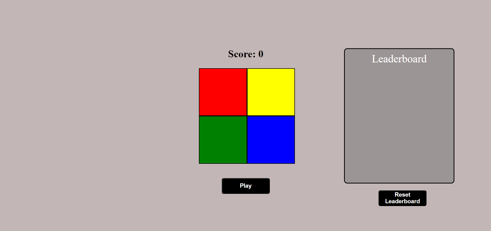
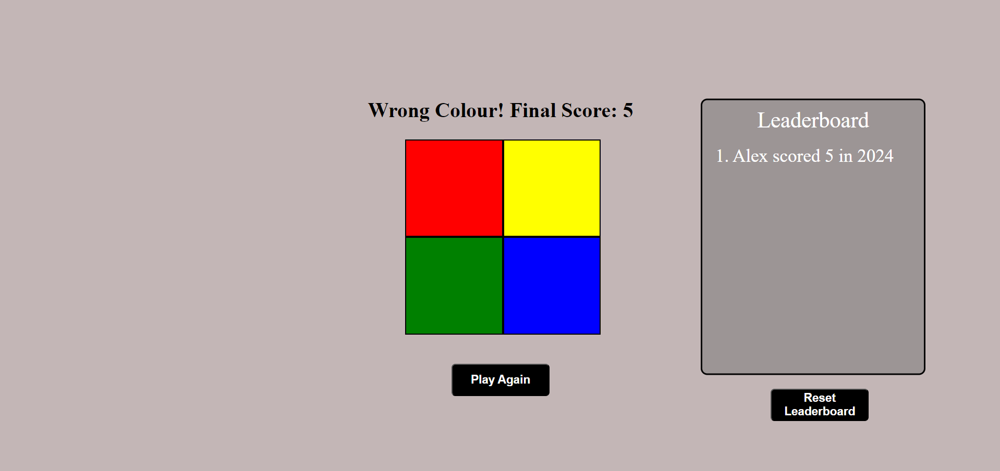

## Simon Game

# Project Aim
This project is a web-based version of the classic Simon memory game. The user is challenged to replicate a sequence of colors and sounds, with the sequence getting progressively longer after each round. The game includes a permanent leaderboard feature that tracks all past scores, making it easy to see who holds the highest score over time.

# Technologies Used
- **Frontend**: HTML, CSS, JavaScript
- **Backend**: Node.js, Express
- **Database**: PostgreSQL

# Key Features
- **Leaderboard**: A persistent leadboard to track all past scores.
- **Leaderboard Reset**: Users can clear all history with the reset button.
- **Play Again**: When the game ends, the user has the option to immediately play again without having to reload the page.
- **Sound/Music**:  Interactive sound effects for each button press, providing feedback on whether the user’s choice was correct or not.

<table>
  <tr>
    <td></td>
    <td></td>
  </tr>
</table>
